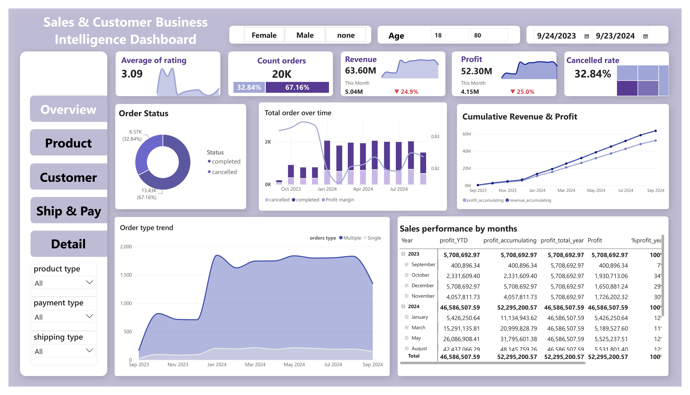
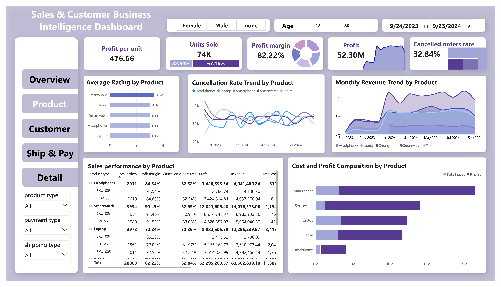
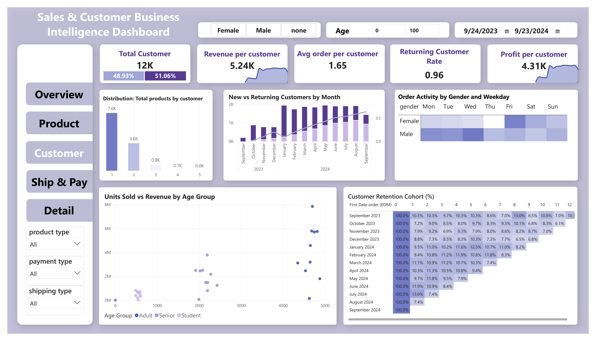
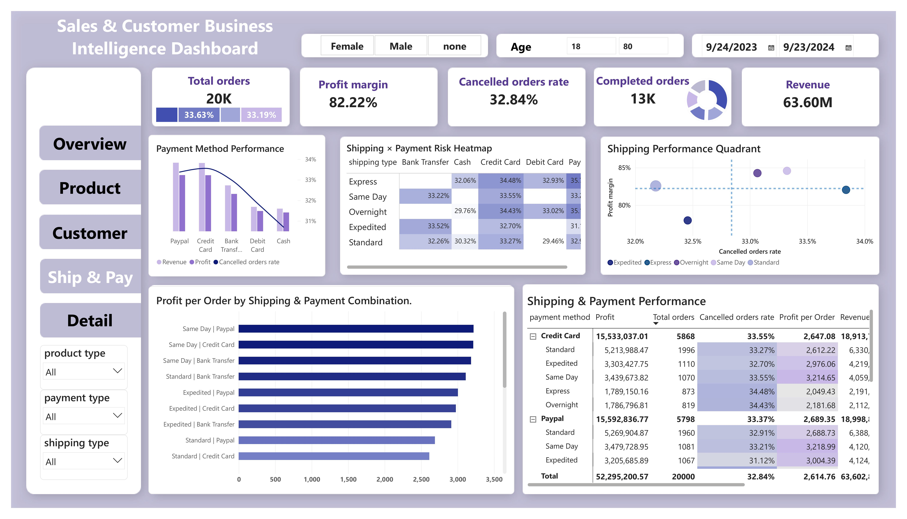
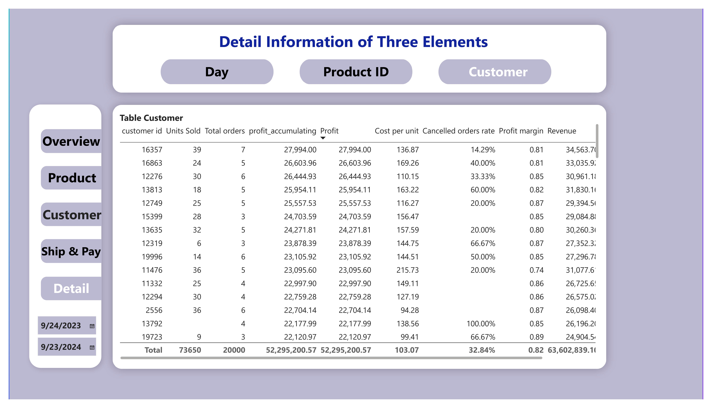

# Sales_Customer
End-to-end Sales &amp; Customer Business Intelligence project using Power BI and SQL Server
## Dashboard Preview

### Executive Overview


### Product Performance


### Customer Analytics


### Shipping & Payment Analysis


### Detail View

# Sales and Customer Business Intelligence Project

## Project Overview

This project analyzes sales and customer data for an electronic products business using Power BI and SQL Server.

The dataset contains transaction data from September 2023 to September 2024. The project focuses on sales performance, customer behavior, product performance, payment methods, shipping methods, profitability, and order cancellation.

The main purpose of this project is to transform raw transaction data into a structured data model and provide useful business insights through SQL analysis and Power BI dashboards.

The final dataset contains approximately:

- 20,000 orders
- 12,136 customers
- 13 products
- 5 payment methods
- 5 shipping methods

## Business Questions

This project was developed to answer several business questions:

1. Which product categories generate the most revenue and profit?
2. Which product categories have the highest profit margins?
3. Which customers contribute the most revenue?
4. How do customers differ in purchasing behavior?
5. Which shipping methods perform better in terms of revenue, profit, and cancellation rate?
6. How do payment methods differ in business performance?
7. Are there shipping and payment combinations with higher cancellation rates?
8. How do revenue and profit change over time?
9. Which areas should receive more attention from the business?

## Dataset

The original transaction data was stored in multiple monthly files.

The transaction data includes information such as:

- Order ID
- Customer ID
- Product ID
- Purchase date
- Order status
- Payment ID
- Shipping ID
- Loyalty status
- Rating
- Quantity
- Unit cost

Additional tables were used to provide information about customers, products, payment methods, and shipping methods.

The data covers the period from September 2023 to September 2024.

## Data Preparation

Power Query was used to prepare the data before building the dashboard.

The main data preparation steps included:

- Combining monthly transaction files
- Checking missing values
- Checking duplicate records
- Standardizing column names
- Standardizing data types
- Standardizing order status values
- Handling missing customer information
- Merging transaction data with related dimension tables
- Preparing fact and dimension tables for analysis

After cleaning, the data was loaded into the Power BI data model.

## Data Model

The project uses a dimensional data model with one main fact table and several dimension tables.

### fact_order

The fact table contains transaction-level information.

Main fields:

- order_id
- purchase_date
- customer_id
- product_id
- payment_id
- shipping_id
- loyalty
- Status
- orders_type
- rating
- quantity
- unit_cost

### dim_customer

Contains customer information.

Main fields:

- customer_id
- age
- gender

### dim_product

Contains product information.

Main fields:

- product_id
- sku
- product_type
- unit_price

### dim_payment

Contains payment information.

Main fields:

- payment_id
- payment_method
- payment_type

### dim_shipping

Contains shipping information.

Main fields:

- shipping_id
- shipping_type
- shipping_category
- shipping_cost_level

The fact table is connected to the dimension tables through customer ID, product ID, payment ID, and shipping ID.

## SQL Database

SQL Server was used to build a separate relational version of the analytical model.

The database contains:

- dim_customer
- dim_product
- dim_payment
- dim_shipping
- fact_order

Primary keys were created for the dimension tables and the order table.

Foreign keys were also created between fact_order and the dimension tables to maintain referential integrity.

The SQL database was built from staging tables that contained the imported data.

## Data Validation

Data validation was performed before the main analysis.

The checks included:

- Row count validation
- Missing value checks
- Duplicate ID checks
- Missing key field checks
- Customer ID matching
- Product ID matching
- Payment ID matching
- Shipping ID matching
- Referential integrity checks

The final model contains:

- 20,000 orders
- 12,136 customers
- 13 products
- 5 payment methods
- 5 shipping methods

The validation queries did not identify unmatched customer, product, payment, or shipping IDs in the final dataset.

## SQL Analysis

Several SQL queries were created to analyze business performance.

### Product Performance

Product performance was analyzed using:

- Total orders
- Units sold
- Revenue
- Total cost
- Profit
- Profit margin
- Average rating
- Cancellation rate

### Customer Performance

Customer-level analysis includes:

- Total orders
- Units purchased
- Revenue
- Profit
- Average rating

This analysis helps identify customers who contribute the most revenue to the business.

### Shipping Performance

Shipping methods were compared using:

- Total orders
- Units sold
- Revenue
- Profit
- Profit margin
- Cancelled orders
- Cancellation rate

### Payment Performance

Payment methods were analyzed using:

- Total orders
- Units sold
- Revenue
- Profit
- Profit margin
- Cancelled orders
- Cancellation rate

### Shipping and Payment Risk Analysis

Shipping methods and payment methods were analyzed together to identify combinations with higher cancellation rates.

The analysis includes:

- Total orders
- Cancelled orders
- Cancellation rate
- Revenue
- Profit
- Profit margin

### Monthly Performance

Monthly business performance was analyzed using:

- Total orders
- Units sold
- Revenue
- Profit
- Profit margin
- Cancellation rate

## Advanced SQL Analysis

Additional SQL queries were created using Common Table Expressions and window functions.

### Product Revenue Ranking

A Common Table Expression and the RANK function were used to rank product categories by revenue.

The results showed that Smartphone had the highest revenue, followed by Smartwatch, Laptop, Tablet, and Headphones.

### Monthly Revenue Growth

Monthly revenue was calculated first and then compared with the previous month using the LAG function.

This was used to calculate month-over-month revenue growth.

### Customer Revenue Ranking

Customer revenue and profit were calculated using a Common Table Expression.

The RANK function was then used to identify the highest-revenue customers.

The SQL analysis demonstrates the use of:

- SELECT
- JOIN
- GROUP BY
- CASE WHEN
- SUM
- COUNT
- AVG
- CTE
- RANK
- LAG
- Window functions
- Date functions
- NULLIF

## Power BI Dashboard

The Power BI report contains several pages designed for different analysis purposes.

## Dashboard Preview

### Executive Overview


The Executive Overview page provides a general view of business performance.

It includes key indicators such as revenue, profit, profit margin, orders, customers, and cancellation rate.

It also provides an overview of sales trends and product performance.

### Product Performance


The Product Performance page focuses on product-level analysis.

It compares product categories using revenue, profit, units sold, profit margin, rating, and cancellation rate.

This page helps identify which product categories contribute the most to overall business performance.

### Customer Analytics


The Customer Analytics page focuses on customer behavior and customer value.

The analysis includes customer revenue, purchasing frequency, customer characteristics, and retention behavior.

A cohort retention analysis is also included to examine customer retention over time.

### Shipping and Payment Analysis


The Shipping and Payment page focuses on operational performance.

It compares shipping and payment methods based on revenue, profit, profit margin, order volume, and cancellation rate.

The page also includes a Shipping and Payment Risk Heatmap to identify combinations associated with higher cancellation rates.

A shipping performance quadrant is used to compare profit margin and cancellation rate across shipping methods.

### Detail View


The Detail page provides transaction-level information and allows users to examine the data in more detail.

This page supports more detailed investigation after identifying a pattern from the main dashboard pages.

## Key Business Insights

### Smartphone is the largest revenue contributor

Smartphone products generated approximately 21.52 million in revenue.

This represents about one-third of total project revenue, making Smartphone the largest revenue contributor among the product categories.

This indicates that overall sales performance is strongly influenced by the Smartphone category.

### Smartwatch has a strong profit margin

Smartwatch generated approximately 14.04 million in revenue.

Although its revenue was lower than Smartphone, its profit margin was approximately 91.49 percent.

This shows that revenue alone should not be used to evaluate product performance. A category with lower revenue can still provide strong profitability.

### Cancellation rates are similar across product categories

Cancellation rates across product categories were generally around 32 to 33 percent.

There was no single product category with an extremely different cancellation rate.

This suggests that cancellation may not be caused by one specific product category and should also be investigated using other dimensions such as shipping and payment methods.

### Shipping methods show limited differences in cancellation rate

Cancellation rates across shipping methods were relatively close.

For example, Express shipping had a cancellation rate of approximately 33.84 percent, while Standard shipping was approximately 32.18 percent.

The differences in profitability between shipping methods were more noticeable than the differences in cancellation rates.

This suggests that shipping method may have a stronger relationship with profitability than with cancellation behavior.

### Some shipping and payment combinations have higher cancellation rates

The combined analysis of shipping and payment methods identified several combinations with higher cancellation rates.

For example:

- Express with PayPal had a cancellation rate of approximately 35.75 percent
- Overnight with PayPal had a cancellation rate of approximately 35.13 percent

These combinations should be investigated further.

The available data shows an association between these combinations and cancellation rate, but it does not prove that the shipping or payment method directly causes cancellation.

### Revenue is distributed across many customers

The highest-revenue customer generated approximately 34.56 thousand in revenue from 7 orders.

Compared with total project revenue of approximately 63.60 million, the contribution of the highest-revenue customer is relatively small.

This indicates that overall revenue is distributed across a broad customer base rather than depending heavily on a small number of customers.

## Analytical Limitation

The first and last months in the dataset are not complete months.

The dataset begins during September 2023 and ends during September 2024.

Because of this, month-over-month comparisons involving these two months should be interpreted carefully.

For example, a large increase from September 2023 to October 2023 may partly result from September containing fewer days of data.

Similarly, the decrease in September 2024 should not automatically be interpreted as a decline in business performance because September 2024 is also a partial month.

Full-month periods should therefore be prioritized when evaluating monthly trends.

## Tools Used

- Power BI
- Power Query
- DAX
- Microsoft SQL Server
- SQL Server Management Studio
- Data Modeling
- SQL
- Data Validation
- Data Visualization
- Business Intelligence Analysis

## Repository Structure

```text
Sales_Customer/
|
|-- README.md
|
|-- dashboard/
|   |-- Power BI dashboard file
|
|-- images/
|   |-- overview.jpg
|   |-- product.jpg
|   |-- customer.jpg
|   |-- shipping&payment.jpg
|   |-- Detail.jpg
|
|-- SQL/
|   |-- 01_database_schema.sql
|   |-- 02_data_validation.sql
|   |-- 03_business_analysis.sql
|   |-- 04_advanced_analysis.sql
|
|-- docs/
|   |-- data_dictionary.md
